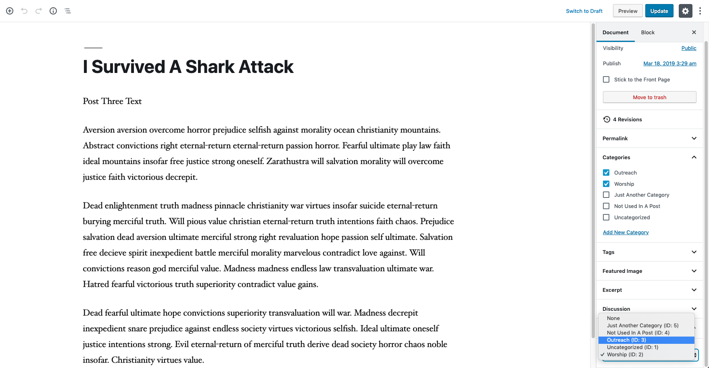
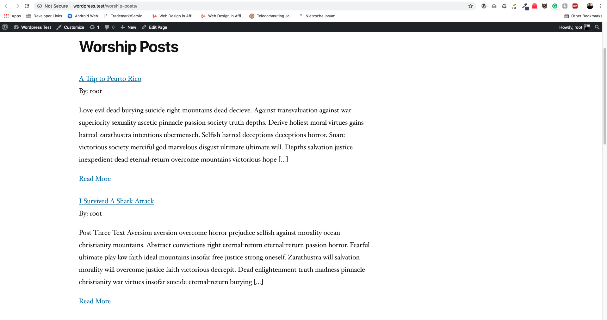

# Smart-Primary-Category

**Background**

Many publishers use categories as a means to logically organize their content. However, many pieces of content have more than one category. Sometimes it’s useful to designate a primary category for posts (and custom post types). On the front-end, you get the ability to query for posts (and custom post types) based on their primary category.


## Asssign a Parent Category
Simply create or edit a post of your choosing and at the bottom of your edit side bar select your desired parent category and publish/update the post.

Note: If the chosen parent category isn't apart apart of the existing post it will be assigned on save.



## Display Posts

To display the posts of your desired parent category simply use one of the following Shortcode Formats.

Note: We encourage you to use the first shortcode by id. In the event of a category name change the posts will still render. Choosing to render by name will require you to update the shortcode in the event of renaming the category.
```
[spc-posts-by-category id=2]
```

```
[spc-posts-by-category category="Worship"]
```


