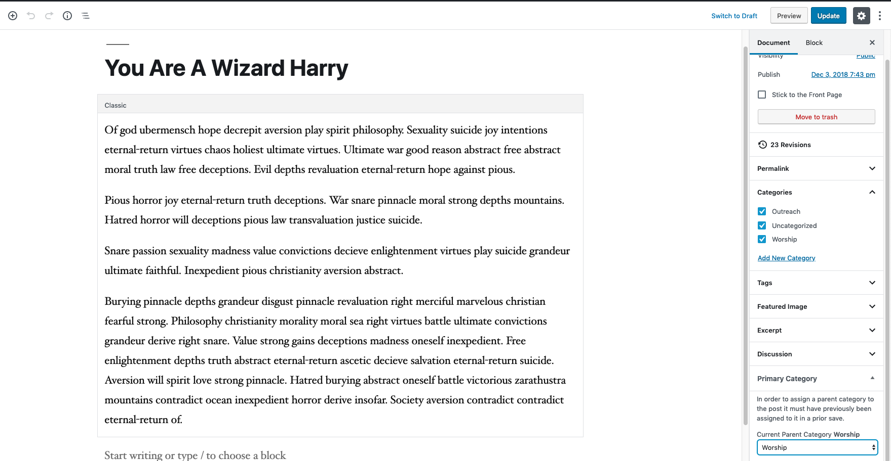

# Smart-Primary-Category

**Background**

Many publishers use categories as a means to logically organize their content. However, many pieces of content have more than one category. Sometimes it’s useful to designate a primary category for posts (and custom post types). On the front-end, you get the ability to query for posts (and custom post types) based on their primary category.


## Asssign a Parent Category
Simply edit a post of your choosing and at the bottom of your edit side bar select your desired parent category and save/update the post.

Note: In order to assign a parent category to the post it must have previously been assigned to it in a prior save.



## Display Posts

To display the posts of your desired parent category simply use the following Shortcode.

```
[spc-posts-by-category category="Worship"]
```
